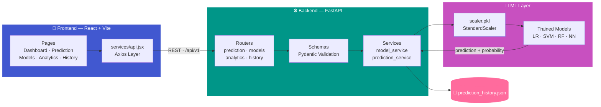
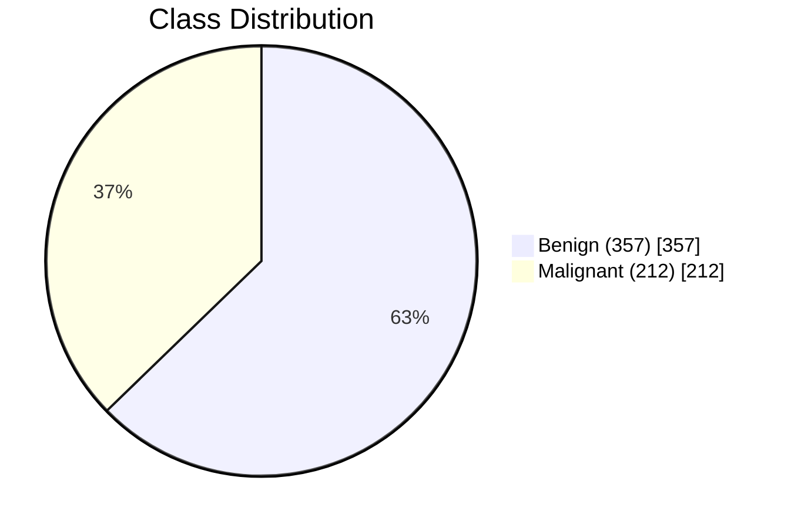
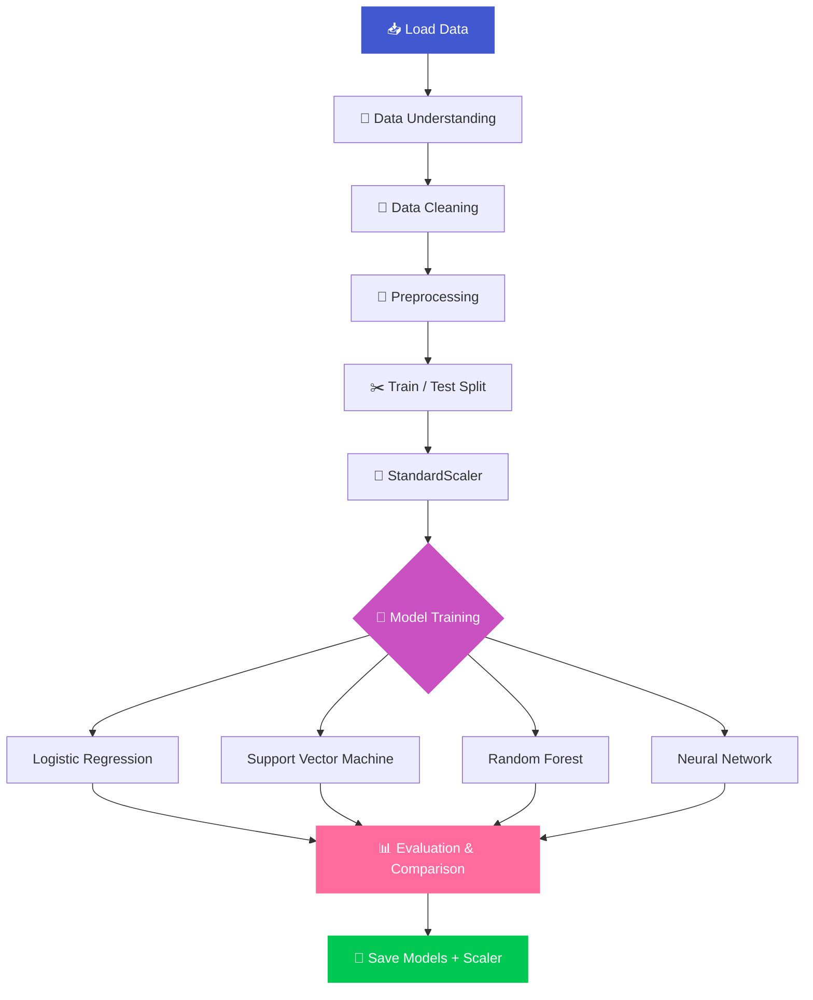
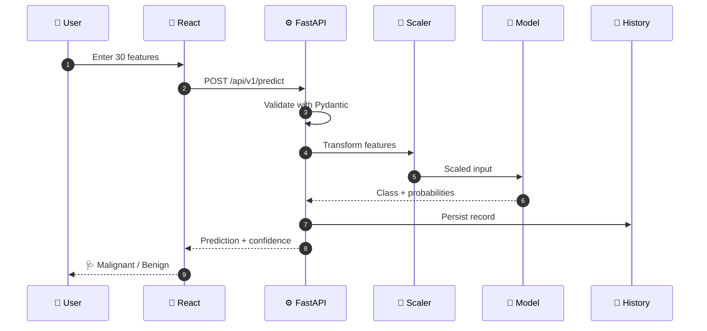

<div align="center">


<br/>

[](https://www.python.org/)
[](https://fastapi.tiangolo.com/)
[](https://react.dev/)
[](https://vitejs.dev/)
[](https://scikit-learn.org/)
[](https://www.tensorflow.org/)

<br/>


</div>


> [!WARNING]
> **Educational / demonstration project only.** BreastAI is **not** a medical diagnosis system and must never be used for real clinical decisions. Always consult a qualified healthcare professional.


<details open>
<summary><b>📑 Table of Contents</b></summary>
<br/>

| | | |
|---|---|---|
| [🔍 Overview](#-overview) | [✨ Features](#-features) | [🛠 Tech Stack](#-tech-stack) |
| [🏗 Architecture](#-architecture) | [📁 Structure](#-project-structure) | [📊 Dataset](#-dataset) |
| [⚙️ ML Pipeline](#️-ml-pipeline) | [🏆 Performance](#-model-performance) | [🚀 Getting Started](#-getting-started) |
| [🔌 API Reference](#-api-reference) | [🖥 Pages](#-application-pages) | [📉 Visualizations](#-visualizations) |
| [✅ Status](#-project-status) | [🔭 Roadmap](#-roadmap) | [👩‍💻 Author](#-author) |

</details>

---

## 🔍 Overview

BreastAI trains and compares **four machine learning models** on the Breast Cancer Wisconsin dataset and serves them through a production-style REST API. Users enter **30 medical features** in a React interface and instantly receive a **Malignant / Benign** classification with class probabilities, a confidence score, and the model used — while every prediction is logged to a searchable history.

<table>
<tr>
<td width="33%" align="center">

### 🧠
**End-to-End ML**

Understanding → Cleaning → Preprocessing → Training → Evaluation → Comparison

</td>
<td width="33%" align="center">

### ⚡
**Clean API Design**

Routers, schemas and services cleanly separated in FastAPI with Pydantic validation

</td>
<td width="33%" align="center">

### 🎨
**Modern SPA**

React + Vite frontend consuming a single centralized Axios service layer

</td>
</tr>
</table>

---

## ✨ Features

<table>
<tr>
<td width="50%">

#### 🔮 Smart Prediction
30 feature inputs → instant Malignant/Benign result with confidence score and class probabilities.

</td>
<td width="50%">

#### 🧪 One-Click Sample Data
Prefill the entire form with a valid sample record for rapid testing.

</td>
</tr>
<tr>
<td width="50%">

#### 📊 Model Comparison
Accuracy, Precision, Recall, F1 and AUC side-by-side for all four models.

</td>
<td width="50%">

#### 🏆 Best Model Detection
The top-performing model is auto-highlighted across the UI and API.

</td>
</tr>
<tr>
<td width="50%">

#### 📈 Live Analytics
Dataset statistics, class balance and real-time model performance metrics.

</td>
<td width="50%">

#### 🕓 Prediction History
View, inspect and delete every past prediction, persisted server-side.

</td>
</tr>
<tr>
<td width="50%">

#### 📉 Visual Reports
Confusion matrix, ROC curves, correlation heatmaps and distribution plots.

</td>
<td width="50%">

#### 📘 Interactive Docs
Auto-generated Swagger UI for exploring and testing every endpoint.

</td>
</tr>
</table>

---

## 🛠 Tech Stack

<div align="center">


</div>

<div align="center">

| 🎨 Frontend | ⚙️ Backend | 🤖 Machine Learning | 🧰 Tools |
|:---:|:---:|:---:|:---:|
| React.js | Python | Scikit-learn | Git |
| Vite | FastAPI | TensorFlow / Keras | GitHub |
| Axios | Uvicorn | NumPy | VS Code |
| Lucide React | Pydantic | Pandas | Swagger UI |
| CSS | | Joblib | |

</div>

---

## 🏗 Architecture



---

## 📁 Project Structure

<details>
<summary><b>📂 Click to expand the full tree</b></summary>
<br/>

```
Breast-Cancer-Prediction/
│
├── 🔧 backend/
│   ├── data/
│   │   └── prediction_history.json
│   ├── routers/
│   │   ├── analytics.py
│   │   ├── history.py
│   │   ├── models.py
│   │   └── prediction.py
│   ├── schemas/
│   │   └── prediction.py
│   ├── services/
│   │   ├── model_service.py
│   │   └── prediction_service.py
│   └── main.py
│
├── 🎨 frontend/
│   ├── public/
│   ├── src/
│   │   ├── components/
│   │   ├── pages/
│   │   │   ├── Dashboard.jsx
│   │   │   ├── Prediction.jsx
│   │   │   ├── Models.jsx
│   │   │   ├── Analytics.jsx
│   │   │   └── History.jsx
│   │   ├── services/
│   │   │   └── api.jsx
│   │   └── App.jsx
│   └── package.json
│
├── 🤖 ml/
│   ├── data/
│   │   ├── raw/
│   │   └── processed/
│   ├── models/
│   ├── reports/
│   │   └── figures/
│   ├── load_data.py
│   ├── data_understanding.py
│   ├── data_cleaning.py
│   ├── data_preprocessing.py
│   ├── eda.py
│   ├── train_model.py
│   ├── evaluate_model.py
│   ├── compare_models.py
│   └── visualize_model_comparison.py
│
├── 📚 docs/
└── 🚫 .gitignore
```

</details>

---

## 📊 Dataset

<div align="center">

**Breast Cancer Wisconsin (Diagnostic) Dataset**


</div>



| Property | Value | |
|---|---|---|
| Total Records | `569` |  |
| Total Features | `30` |  |
| Malignant Cases | `212` | `37.3%` |
| Benign Cases | `357` | `62.7%` |
| Missing Values | `0` |  |
| Duplicates | `0` |  |
| Infinite Values | `0` |  |

---

## ⚙️ ML Pipeline



<details>
<summary><b>💾 Generated artifacts</b></summary>
<br/>

| `ml/data/processed/` | `ml/models/` |
|---|---|
| `X_train.csv` | `logistic_regression.pkl` |
| `X_test.csv` | `support_vector_machine.pkl` |
| `y_train.csv` | `random_forest.pkl` |
| `y_test.csv` | `breast_cancer_model.keras` |
| `scaler.pkl` | `best_model.keras` |

</details>

---

## 🏆 Model Performance

<div align="center">

| 🥇 | Model | Accuracy | Precision | Recall | F1 Score | AUC |
|:---:|---|:---:|:---:|:---:|:---:|:---:|
| 🥇 | **Logistic Regression** |  | `98.61%` | `98.61%` | `98.61%` |  |
| 🥈 | **Support Vector Machine** |  | `98.61%` | `98.61%` | `98.61%` |  |
| 🥉 | **Neural Network** |  | `98.57%` | `95.83%` | `97.18%` |  |
| 4️⃣ | **Random Forest** |  | `95.89%` | `97.22%` | `96.55%` |  |

</div>

**Accuracy at a glance**

```
Logistic Regression   ████████████████████████████████████████  98.25%  🥇
Support Vector Mach.  ████████████████████████████████████████  98.25%
Neural Network        ███████████████████████████████████████░  96.49%
Random Forest         ██████████████████████████████████████░░  95.61%
```

> [!TIP]
> **Logistic Regression** is the deployed best model — it ties on accuracy with SVM but edges ahead on AUC (`99.54%`), while staying the fastest and most interpretable of the four.

---

## 🚀 Getting Started

<div align="center">


</div>

### 1️⃣ Clone the repository

```bash
git clone https://github.com/srigakollumounika/breast-cancer-prediction.git
cd breast-cancer-prediction
```

### 2️⃣ Backend setup

```bash
# Create a virtual environment
python -m venv venv

# Activate it
venv\Scripts\activate        # Windows
source venv/bin/activate     # macOS / Linux

# Install dependencies
pip install -r requirements.txt
```

<details>
<summary><b>📦 No requirements.txt yet?</b></summary>
<br/>

```bash
pip install fastapi uvicorn pydantic scikit-learn tensorflow numpy pandas joblib
pip freeze > requirements.txt
```

</details>

### 3️⃣ Train the models *(optional — pre-trained models are included)*

```bash
python ml/load_data.py
python ml/data_preprocessing.py
python ml/train_model.py
python ml/compare_models.py
```

### 4️⃣ Run the backend

```bash
uvicorn backend.main:app --reload
```

<div align="center">

| Service | URL |
|---|---|
|  | http://127.0.0.1:8000 |
|  | http://127.0.0.1:8000/docs |

</div>

### 5️⃣ Run the frontend

```bash
cd frontend
npm install
npm run dev
```

<div align="center">


</div>

---

## 🔌 API Reference

<div align="center">

**Base URL** · `http://127.0.0.1:8000/api/v1`

</div>

<details open>
<summary><b>🔮 Prediction</b></summary>
<br/>

| Method | Endpoint | Description |
|:---:|---|---|
|  | `/predict` | Predict tumor class from 30 features |

</details>

<details>
<summary><b>🤖 Models</b></summary>
<br/>

| Method | Endpoint | Description |
|:---:|---|---|
|  | `/models/` | List all trained models |
|  | `/models/best` | Get the best-performing model |
|  | `/models/comparison` | Full metric comparison |

</details>

<details>
<summary><b>📈 Analytics</b></summary>
<br/>

| Method | Endpoint | Description |
|:---:|---|---|
|  | `/analytics/overview` | Summary statistics |
|  | `/analytics/dataset` | Dataset information |
|  | `/analytics/performance` | Model performance metrics |
|  | `/analytics/system` | System information |

</details>

<details>
<summary><b>🕓 History</b></summary>
<br/>

| Method | Endpoint | Description |
|:---:|---|---|
|  | `/history/` | All past predictions |
|  | `/history/{id}` | A single prediction |
|  | `/history/{id}` | Delete a prediction |

</details>

### 🔄 Request lifecycle



### 📤 Sample response

```json
{
  "prediction": "Malignant",
  "prediction_value": 0,
  "confidence": 100,
  "probabilities": {
    "malignant": 1,
    "benign": 0
  },
  "model_used": "logistic_regression"
}
```

---

## 🖥 Application Pages

<div align="center">

| | Page | What it shows |
|:---:|---|---|
| 🏠 | **Dashboard** | Total predictions, dataset samples, best model, accuracy, system info, project insights |
| 🔮 | **Prediction** | 30 inputs, Fill Sample Data / Generate / Reset, result with confidence and probabilities |
| 🤖 | **Models** | All 4 models with accuracy, precision, recall, F1, AUC and a best-model indicator |
| 📈 | **Analytics** | Top statistics, dataset information and model performance breakdown |
| 🕓 | **History** | Full prediction history with view and delete support |

</div>

> All frontend requests flow through a single centralized Axios service at `frontend/src/services/api.jsx`, handling health, system status, prediction, models, analytics and history.

---

## 📉 Visualizations

<div align="center">

Generated into `ml/reports/figures/`

| | | |
|:---:|:---:|:---:|
| 🎯 `confusion_matrix.png` | 🔥 `correlation_heatmap.png` | 📦 `feature_boxplots.png` |
| 📊 `feature_distributions.png` | 🏅 `model_accuracy_comparison.png` | 📈 `model_auc_comparison.png` |
| 📋 `model_metrics_comparison.png` | 〽️ `roc_curve.png` | 🥧 `target_distribution.png` |

</div>

---

## ✅ Project Status

<div align="center">


</div>

| Component | Status | | Component | Status |
|---|:---:|---|---|:---:|
| Machine Learning Models | ✅ | | Models Page | ✅ |
| FastAPI Backend | ✅ | | Analytics Page | ✅ |
| React Frontend | ✅ | | History Page | ✅ |
| Prediction Flow | ✅ | | API Testing (Swagger) | ✅ |
| Dashboard | ✅ | | Git & GitHub | ✅ |

---

## 🔭 Roadmap

- [ ] 🌐 Deploy frontend and backend for public access
- [ ] 🔐 User authentication for private prediction history
- [ ] 🗄️ Migrate history from JSON to a database
- [ ] 🧠 Model explainability (SHAP / feature importance)
- [ ] 📑 Batch prediction via CSV upload
- [ ] 🐳 Dockerize the full stack
- [ ] ⚙️ CI/CD pipeline with automated tests

---

## 👩‍💻 Author

<div align="center">

**srigakollumounika**

[](https://github.com/srigakollumounika)
[](https://github.com/srigakollumounika/breast-cancer-prediction)

<br/>

### ⭐ If this project helped you, consider giving it a star!


</div>
